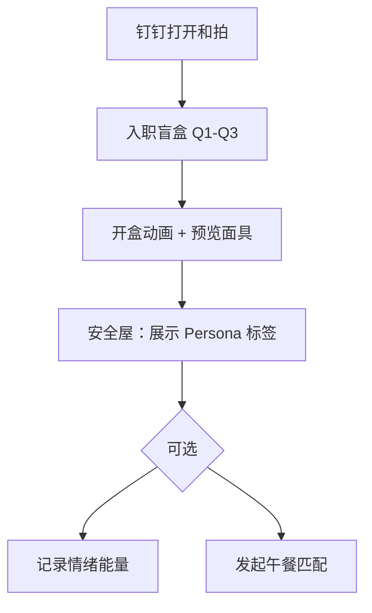
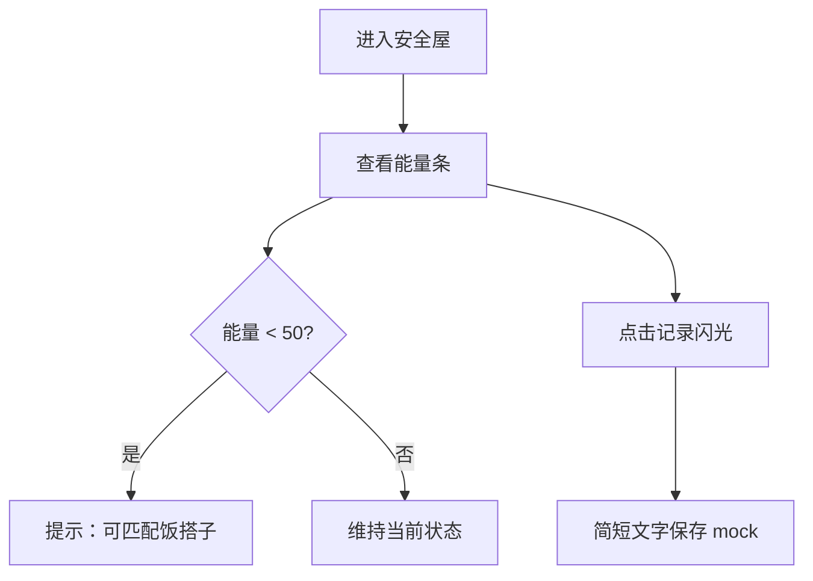
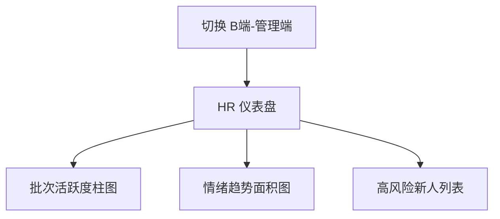
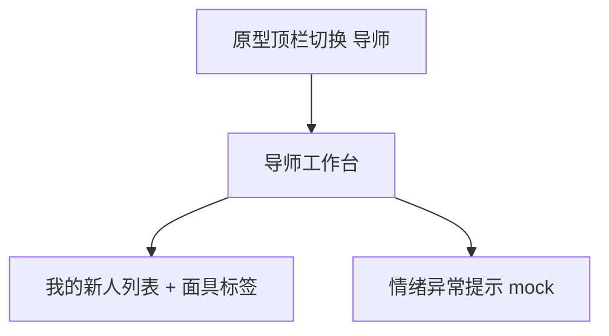

# 02 · 关键用户旅程（3 条）

> 低保真线框说明：用 ASCII + 流程图描述步骤与页面跳转，评审前不依赖高保真视觉。

---

## 旅程 A · 首次入职（新人）

**目标**：3 分钟内完成面具生成并进入安全屋，理解「前 30 天可匿名社交」。



**线框 · 盲盒页**

```
┌─────────────────────┐
│ ■ 01 性格确定  ●○○  │
├─────────────────────┤
│  Q: 下班内心 OS？    │
│  [ 选项 A ]         │
│  [ 选项 B ]         │
│  [ 选项 C ]         │
├─────────────────────┤
│ 🔒 隐私承诺（30天）  │
└─────────────────────┘
```

**线框 · 安全屋**

```
┌─────────────────────┐
│ 头像  昵称 #D30      │
│ [面具名][标签][标签] │
│ 能量 ████░░ 75%     │
├─────────────────────┤
│ 午餐匹配卡片         │
│ 导师库（2条）        │
├─────────────────────┤
│ [安全屋][蹭饭][导师] │
└─────────────────────┘
```

**验收点**

- [ ] 共 3 题，无多余注册步骤
- [ ] 开盒后面具名 / 标签 / 格言与安全屋一致（数据贯通）
- [ ] 底部导航仅在完成盲盒后出现

---

## 旅程 B · 日常情绪（新人）

**目标**：低摩擦更新「情绪能量」，在偏低时得到引导（匹配 / 记录闪光）。



**线框 · 情绪区**

```
┌──────────┐
│ ♥ 75%    │
│ ▓▓▓▓▓░░░ │
│ 偏低？    │
└──────────┘
     ↓
[记录今日闪光_LOG]
```

**验收点**

- [ ] 滑动或按钮可改能量（原型 mock）
- [ ] 能量变化写入本地状态，刷新后仍可见
- [ ] 文案偏鼓励、无 KPI 压迫感

---

## 旅程 C · HR 看板（管理员）

**目标**：一屏看清批次健康度与情绪趋势，识别需关注新人。



**线框**

```
┌─────────────────────┐
│ HR Dashboard        │
│ [统计卡][统计卡]     │
│ ┌─────┐ ┌─────┐    │
│ │柱状图│ │情绪图│    │
│ └─────┘ └─────┘    │
│ 新人列表 + 风险标签  │
└─────────────────────┘
```

**验收点**

- [ ] C/B 切换后路由互斥，不会混用新人底部导航
- [ ] 图表数据为 mock，但字段名与 API 文档一致
- [ ] 无新人私密答题原文，仅聚合指标

---

## 旅程 D · 导师视角（MVP 占位）

**目标**：证明第三角色存在，避免评审误以为只有 C/B 两端。



> 旅程 D 在原型中为 **只读占位**，完整 IM 触达放在二期。
