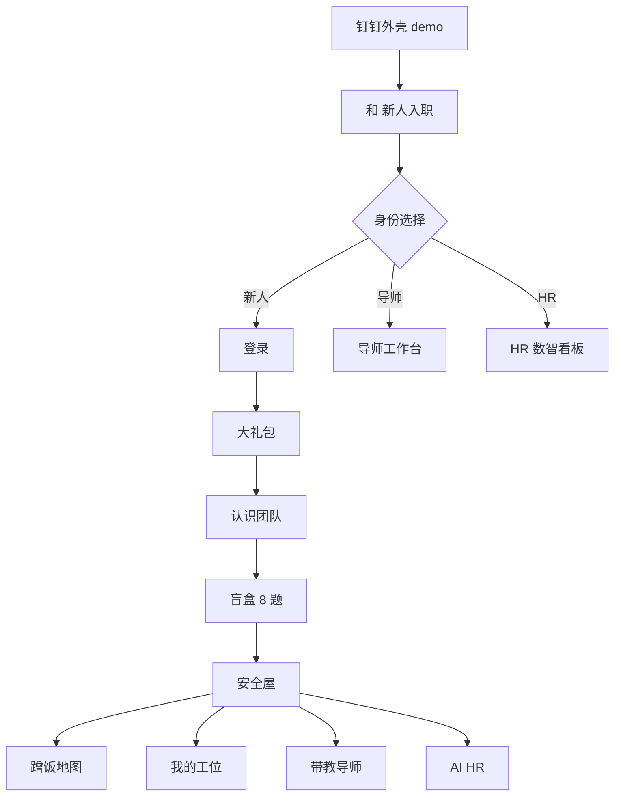

# 和拍 · 前端设计展示

> 可视化总览：在 Cursor 中打开 `hepai-design-showcase.canvas`（侧边 Canvas 面板）。

---

## 一、设计定位

| 项 | 说明 |
|----|------|
| 产品 | 钉钉企业内部 H5 · 新人入职社交互助 |
| 风格 | **钉钉浅色统一**：浅灰底、白卡片、轻阴影、14px 圆角 |
| 基准视口 | **375 × 812**（手机逻辑像素） |
| 字体 | 正文 Outfit + Noto Sans SC；标签 IBM Plex Mono |

---

## 二、色彩体系（`src/index.css`）

| Token | 色值 | 用途 |
|-------|------|------|
| Primary | `#1677FF` | 钉钉蓝 · 主按钮 · 新人 |
| Secondary | `#13C2C2` | 青绿 · 导师 |
| Tertiary | `#722ED1` | 紫 · HR |
| Accent | `#F59E0B` | 琥珀 · 星罐/高光 |
| Cream | `#F5F6F8` | 页面背景 |
| Surface | `#FFFFFF` | 卡片 |
| On Surface | `#171A1D` | 主文字 |
| Outline | `#DDE1E6` | 边框 |

**工具类：** `neo-card` · `neo-button` · `neo-button-primary`

---

## 三、信息架构



---

## 四、核心页面

### 身份选择（RoleGateView）

- 顶栏「和」字 Logo + 标题
- 三张角色卡：新人（蓝）/ 导师（青）/ HR（紫）
- 微动效入场

### 新人首次流程

1. **WelcomeGiftModal** — 入职大礼包
2. **WelcomeTeamPanel** — 导师、HR、同批伙伴
3. **BlindBoxView** — 8 题 + 隐私承诺 + 开盒
4. **WorkplaceView** — 面具、情绪条、导航

### 新人功能页

| 页面 | 关键 UI |
|------|---------|
| 安全屋 | 人格面具、社交标签、能量滑块 |
| 蹭饭地图 | 匹配状态机、结果卡 |
| 我的工位 | 贴画桌面、餐券/星星 |
| 带教导师 | 导师卡片、状态灯 |
| 闪光星罐 | 折纸星星投入玻璃罐 |
| AI HR | 准则侧栏 + 对话 |

### 导师 / HR

| 页面 | 关键 UI |
|------|---------|
| 导师工作台 | 新人列表、面具标签、风险 |
| HR 看板 | KPI 卡、批次柱状图、情绪趋势 |

---

## 五、本机预览（可交互整体演示）

### 设计展示页（推荐）

```bash
npm run showcase
```

自动打开 **http://127.0.0.1:3000/showcase.html**

- **左侧**：全部场景导航（接入 / 新人 / 导师 / HR）
- **中间**：操作说明 +「一键进入此场景」
- **右侧**：实时可点击的原型（iframe，非静态截图）
- 顶部可切换 **电脑端 / 手机 H5**

### 全屏演示

```bash
npm run demo          # 钉钉 PC 外壳 → http://127.0.0.1:3000
npm run pilot:dingtalk  # 手机 H5 同款 → :8080
```

---

## 六、相关文档

| 文档 | 内容 |
|------|------|
| `07-design-handoff.md` | 组件清单、Token、API 映射 |
| `03-information-architecture.md` | 页面 ID、导航规则 |
| `04-platform-constraints.md` | 钉钉视口与安全区 |
| `17-前端页面展示说明.md` | 怎么打开、演示路径 |
